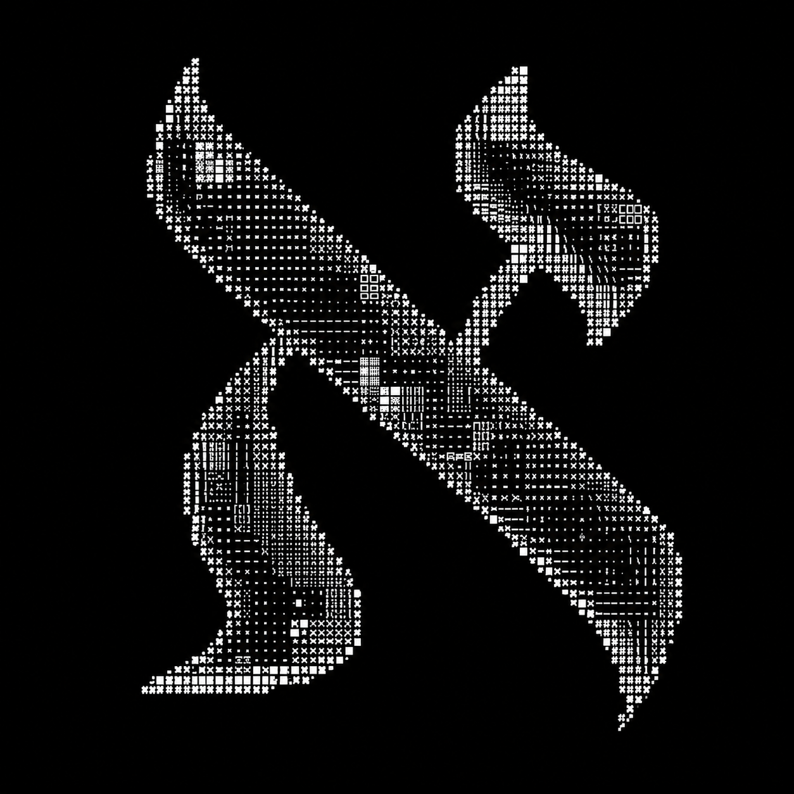

<div align=\"center\">

```
 _  _ ___ __  __   _   _  _ ___ _  _ _   _    ___   _   _  _ ___   _   _
| || |_ _|  \/  | /_\ | \| / __| || | | | | | | _ ) /_\ | \| / __| /_\ | |
| __ || || |\/| |/ _ \| .` \__ \ __ | |_| | | _ \/ _ \| .` \__ \/ _ \| |__
|_||_|___|_|  |_/_/ \_\_|\_|___/_||_|\___/  |___/_/ \_\_|\_|___/_/ \_\____|
```

```
> systems.online  |  brew: cappuccino  |  location: /dev/india  |  status: shipping
```

</div>

<table>
<tr>
<td width=\"35%\">



`[SYSTEM]: ./init_golem.sh --breathe`

```
> From dust to data
> An ancient engine designed to animate cold,
inanimate code bases into living, breathing
digital ecosystems.
```

</td>
<td width=\"65%\" valign=\"middle\">

### `whoami`

I build things that shouldn't work on paper — then make them work in production.

Somewhere between a **poet** who romanticises loss functions and a **plumber** who fixes leaks in production at 3AM.

Currently obsessed with:
`RAG` · `Vision AI` · `agents that ship`

```yaml
brain:   AI/ML systems
hands:   Python, FastAPI, PyTorch
heart:   open source
fuel:    filter coffee, cold rain
```

</td>
</tr>
</table>

---

### `~/thoughts.log`

> *\"The best model is the one that survives contact with real users.*
> *Everything else is a nicely plotted delusion.\"*

---

### `$ ls -la projects/`

| | project | one-liner | stack |
|:-:|:--|:--|:--|
| `[1]` | **[AEGIS](https://github.com/thehimanshubansal/AEGIS_Smart_Hospitality)** | An OS for hospitality that watches, listens, and calls for help before you can. | `GenAI` `WebSockets` `GCP` |
| `[2]` | **[HorizonByte](https://github.com/thehimanshubansal/HorizonByte)** | RAG built from first principles — no LangChain, no training wheels. | `FastAPI` `FAISS` `Llama 3.3` |
| `[3]` | **[Disha Darshak](https://github.com/thehimanshubansal/Disha-Darshak-AI)** | A career co-pilot for students who don't have one. Top 10 @ Google Cloud GenAI. | `Next.js` `Gemini` `Firebase` |

---

### `$ cat stack.txt`

```
[ ai   ]     rag · vector search (faiss) · yolo · gnns · llm orchestration
[ code ]     python · c/c++ · sql · a little js & ts when forced
[ infra]     gcp · aws · sentry · firebase · docker · websockets · webrtc · mongodb · kaggle
[ note ]     shipping models. sometimes benchmarking them.
```

---

### `$ history | tail -3`

```
[002]  automation  ~ selenium/mp   cut manual processing by 95%. 4x throughput.
[001]  mentor      ~ samidha       teaching kids who were told they couldn't.
```

---

<div align=\"center\">

### `$ ping himanshu`

[](https://www.linkedin.com/)
[](mailto:abc@gmail.com)
[](https://www.kaggle.com)
[](https://www.instagram.com/)

</div>

---

### `$ ./stats --live`

<div align=\"center\">


<br><br>


</div>

<br>

### `$ ./contributions --3d`

<div align=\"center\">

<!-- 3D graph auto-generated via GitHub Actions (setup below) -->


<br>

<!-- Snake animation auto-generated via GitHub Actions (setup below) -->


</div>

---

<div align=\"center\">

```
$ echo \"thanks for scrolling. now go build something.\" && exit 0
```

<sub>crafted at 2am · powered by curiosity · no LLM was harmed in writing this bio</sub>

</div>
"
